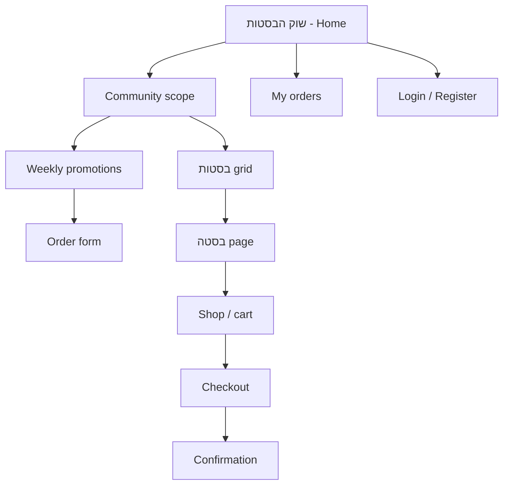

# שוק הבסטות — Full UI/UX Redesign Plan

**Codename:** `שדה ושכונה` (Field & Neighborhood)  
**Status:** Design phase — implementation split into prompts below  
**Scope:** `src/components/marketplace/` (+ `MarketplaceMenu.css`, shared `marketplace.css` tokens)

---

## 1. Design brief

### Problem

The marketplace already has a “farm market” skin, but it reads as a **polite admin template** (Segoe UI, generic cards, single hero photo) rather than a **living community food market**. Discovery, community belonging, and seller personality are under-expressed.

### Goal

Make שוק הבסטות feel **extreme, beautiful, bold** — unmistakably **farming + neighborhood**: people you know, land you trust, weekly rhythm, shared pickup.

**Success signals (qualitative):**

- First-time visitor understands in &lt;5s: community → weekly orders → בסטות
- Community filter feels like “my village,” not a dropdown
- Store pages feel like **stalls at a market**, not product listings
- Seller tools feel part of the same world (not a separate Bootstrap app)

### Users

| Persona | Primary jobs |
|--------|----------------|
| **Neighbor (buyer)** | Pick community → browse promotions → order → pay manually → track orders |
| **Farmer / maker (seller)** | Run בסטה page → weekly promotion → fulfill orders → manage catalog |
| **Guest** | Discover market → register / login when needed |

### Constraints (do not break)

- RTL Hebrew; Rubik for display type (align with app)
- Routes & Firestore shapes unchanged unless a phase explicitly says otherwise
- Manual payment only (Bit, cash, etc.) — no fake “paid” UI
- `PickupSpotContext` + community filter logic stays; **visualize** it better
- Electron + mobile browsers; touch ≥ 44px
- ~2k-line `marketplace.css` → migrate to **tokens + modules** over phases, not one big bang

### Non-goals (V1 redesign)

- Real payment gateway UI
- Volunteer pickup workflow (keep placeholder, style it consistently)
- Rebuilding legacy `/store/:businessId` weekly store
- New backend collections

---

## 2. Creative direction — bold, community, farming

### North star sentence

> **“Friday market before dawn — lanterns still on, mud on boots, everyone knows your name.”**

### Mood (3 pillars)

| Pillar | Expression |
|--------|------------|
| **Farming** | Raw textures: soil, linen, wood crate, chalkboard prices, harvest photography, organic asymmetry |
| **Community** | Faces, neighborhoods, “שכונה שלי”, pickup spot pins, neighbor avatars, social proof (“12 הזמנות השבוע”) |
| **Bold** | Oversized type, full-bleed imagery, strong diagonal crops, high contrast accents, motion with weight — not pastel SaaS |

### Visual personality vs today

| Today | Target |
|-------|--------|
| Cream gradient + one `Field.jpg` | Layered **texture stack** (grain, paper, topo lines) + **per-בסטה** photography |
| Rounded pill buttons everywhere | **Crate labels** (stamped tags), **chalk CTA**, wood primary |
| Uniform card grid | **Bazaar layout**: featured stall hero + mosaic grid + “market aisle” scroll |
| Segoe UI | **Rubik** display + **Assistant** body (Hebrew-friendly, already common in IL) |
| Emoji eyebrow 🧺 | Custom **inline SVG** market icons (basket, sheaf, pin) — emoji only in empty states if at all |

### Layout metaphor

```
┌─────────────────────────────────────────────┐
│  MARKET GATE (hero) — community + season    │
├─────────────────────────────────────────────┤
│  “השבוע בשוק” — weekly promotions (river)   │
├─────────────────────────────────────────────┤
│  “הבסטות” — stalls mosaic + filters         │
├─────────────────────────────────────────────┤
│  “מהקהילה” — stories / trust strip          │
└─────────────────────────────────────────────┘
```

---

## 3. Design scheme — tokens & components

Implement as CSS variables in `marketplace.tokens.css` (new), consumed by refactored `marketplace.css` / per-component modules.

### 3.1 Color

```css
/* Surfaces — soil to linen */
--mp-soil-900:     #1a1410;   /* ink, footer */
--mp-soil-800:     #2d2419;   /* hero overlay */
--mp-soil-700:     #3d2f1f;   /* primary text */
--mp-bark-600:     #5c4a35;   /* secondary text */
--mp-bark-500:     #6b5a45;   /* muted */
--mp-linen-100:    #faf6ee;   /* page base */
--mp-linen-200:    #f4efe4;   /* panels */
--mp-linen-300:    #efe6d4;   /* borders soft */

/* Living greens — crop, not corporate */
--mp-leaf-700:     #2f5a28;
--mp-leaf-600:     #4a7c3f;   /* primary brand green */
--mp-leaf-500:     #5f9a52;   /* hover */
--mp-leaf-100:     #e8f0e4;   /* tint backgrounds */

/* Harvest accents — use sparingly for energy */
--mp-terracotta:   #c45c3e;   /* urgency, deadline, badge */
--mp-sunflower:    #e8b84a;   /* highlights, “featured” */
--mp-berry:        #7a3b55;   /* optional category accent */

/* Wood & craft */
--mp-wood-700:     #6b4423;
--mp-wood-500:     #8b5a2b;   /* borders, nav rule */
--mp-wood-300:     #a67c52;   /* button gradient top */

/* Semantic */
--mp-success:      #3d7a47;
--mp-warning:      #b8860b;
--mp-error:        #a33d2f;
--mp-info:         #3a5f8c;
```

**Usage rules**

- Page background: linen + subtle **noise texture** (SVG data URI or PNG tile, &lt;15kb)
- Primary CTA: **wood gradient** + linen text; secondary: **chalk** (linen fill, soil border)
- Promotion urgency: terracotta chip (“נשארו 3 ימים”)
- Community chip: leaf-100 background + leaf-700 text

### 3.2 Typography

| Token | Font | Size (mobile → desktop) | Use |
|-------|------|-------------------------|-----|
| `--mp-font-display` | Rubik 800 | 2rem → 3.25rem | Hero, stall name |
| `--mp-font-headline` | Rubik 700 | 1.35rem → 1.75rem | Section titles |
| `--mp-font-body` | Assistant 400 | 1rem | Paragraphs |
| `--mp-font-label` | Rubik 600 | 0.75rem → 0.85rem | Tags, eyebrows (uppercase tracking) |
| `--mp-font-price` | Rubik 700 | 1.1rem | Prices, totals |

**Hebrew:** `letter-spacing: 0.01em` on display only; avoid uppercase Hebrew.

### 3.3 Space & radius

| Token | Value |
|-------|-------|
| `--mp-space-xs` … `--mp-space-2xl` | 4, 8, 12, 16, 24, 32, 48, 64px |
| `--mp-radius-sm` | 6px — inputs |
| `--mp-radius-md` | 12px — cards |
| `--mp-radius-lg` | 20px — panels |
| `--mp-radius-stall` | 24px 24px 8px 8px — **stall card** (torn market awning) |
| `--mp-radius-pill` | 999px — chips only |

### 3.4 Elevation & borders

- Cards: `box-shadow: 0 4px 0 var(--mp-wood-500)` (hard shadow, “printed card”)
- Hover: translateY(-3px), shadow grows
- Dividers: 2px dashed `--mp-bark-500` at 40% opacity (market chalk line)

### 3.5 Motion

| Name | Duration | Use |
|------|----------|-----|
| `--mp-ease-snap` | 180ms cubic-bezier(0.2, 0.9, 0.3, 1) | Buttons, toggles |
| `--mp-ease-gentle` | 320ms ease-out | Cards, drawer |
| Stagger | 40ms per item | Grid reveal on home |

Respect `prefers-reduced-motion`: disable stagger and parallax.

### 3.6 Texture & illustration

- **Grain overlay** on `.mp-page::before` (pointer-events: none)
- **Topo contour** faint lines in hero (SVG)
- **Chalk underline** on section titles (`background-image` wavy line)
- Category icons: 24px stroke SVG set (vegetable, fruit, dairy, pantry, flowers)

### 3.7 Core components (naming)

| Component | Class prefix | Notes |
|-----------|--------------|-------|
| Market gate hero | `.mp-gate` | Full-bleed, community selector embedded |
| Community pill rail | `.mp-community-rail` | Replaces plain toggle group |
| Stall card | `.mp-stall` | Replaces `.mp-basta-card` |
| Weekly board card | `.mp-weekly-board` | Replaces `.mp-promo-card` |
| Chalk CTA | `.mp-cta-chalk` | Primary actions |
| Wood button | `.mp-cta-wood` | Secondary / seller |
| Crate badge | `.mp-crate-badge` | Status, kind |
| Market empty | `.mp-market-empty` | Illustration + copy |
| Order ticket | `.mp-ticket` | My orders + seller order cards |
| Seller workbench | `.mp-bench` | Dashboard shell |

---

## 4. Information architecture

### Consumer (`/community-marketplace`)



**IA tweaks (UX, not routes)**

1. **Sticky community context** in nav: “אתם בשוק: {community}” with one-tap change  
2. Home sections renamed for story: `השבוע בשוק` → `מהשדה השבוע` ; `הבסטות בשוק` → `הדוכנים`  
3. Store page: **one** primary CTA — “למכירה השבועית” OR “לחנות” (clear hierarchy)  
4. Checkout: **ticket metaphor** — perforated summary, payment instructions as “קבלה”

### Seller (`/marketplace/*`)

- Unified **workbench** chrome matching consumer market (same nav wood border, tokens)
- Tab labels in Hebrew farmer tone: `הדוכן שלי` | `השבוע בשוק` | `הזמנות` | `מוצרים`

---

## 5. Screen-by-screen direction (summary)

| Screen | File(s) | Bold move |
|--------|---------|-----------|
| Home | `MarketplaceHome.js`, `PromotionHighlights`, `BusinessCardGrid`, `CommunityFilterToggle` | Market gate hero + horizontal weekly “board” + stall mosaic |
| Nav + cart | `MarketplaceMenu.js`, `MarketplaceCart.js` | Taller brand, community chip, cart as “סל השוק” drawer |
| בסטה page | `MarketplaceStorePage.js`, `StoreContentDisplay` | Full-bleed cover, owner story block, chalk hours |
| Shop | `MarketplaceStoreShop.js`, `MarketplaceStoreProductTile` | Product tiles like crate labels with stamp price |
| Checkout | `MarketplaceCheckout.js`, `MarketplaceFulfillmentPicker` | Ticket layout, payment “קבלת תשלום” |
| Order form | `MarketplaceOrderForm.js` | Single-column “order slip” with progress steps |
| My orders | `MarketplaceMyOrders.js`, `MarketplaceOrderCard` | Timeline: נשלח → אושר → מוכן → נאסף |
| Seller dashboard | `SellerMarketplaceDashboard.js`, editors | Workbench tabs, stat cards as “יום בשוק” |
| Products | `products/*` | Table → cards on mobile; approval status as stamps |
| Business orders | `MarketplaceBusinessOrders.js`, `MarketplacePromotionOrders` | Kanban-lite columns by fulfillment status |
| Auth | `MarketplaceLogin.js`, `MarketplaceRegister` | Split panel: photo field + form on linen |

---

## 6. Phased implementation plan

Each phase = **one focused Cursor prompt**. Complete in order; Phase 0 unblocks all others.

### Phase 0 — Foundation (do first)

**Prompt to use:**

> Implement Marketplace redesign Phase 0: add `marketplace.tokens.css` with the design tokens from `docs/Marketplace-Redesign-Plan.md`, import into marketplace entry points, replace hardcoded colors in `marketplace.css` top 200 lines with variables. No layout changes yet.

**Deliverables:** tokens file, CSS variable wiring, screenshot-free smoke test on home.

---

### Phase 1 — Market shell (nav + page frame)

**Files:** `MarketplaceMenu.js`, `MarketplaceMenu.css`, `.mp-page` layout (padding for fixed nav)

- New brand lockup: **שוק הבסטות** + subtitle `מהשדה לשכונה`
- Community chip in header (read from pickup spot)
- Cart drawer restyle (“סל השוק”)
- Mobile menu: full-height linen panel, large touch links

---

### Phase 2 — Home / discovery (consumer)

**Files:** `MarketplaceHome.js`, `CommunityFilterToggle.js`, `PromotionHighlights.js`, `BusinessCardGrid.js`, `BastaStoreCard.js`

- Replace hero with `.mp-gate` (texture, topo, embedded community rail)
- Weekly promotions → horizontal scroll **market board** with deadline chips
- Stall grid → mosaic (featured stall spans 2 cols on desktop)
- Seller CTA banner → illustrated “פתחו דוכן” strip

---

### Phase 3 — בסטה public page

**Files:** `MarketplaceStorePage.js`, `StoreContentDisplay.js`, `MarketplaceFulfillmentSummary.js`

- Cinematic cover + gradient soil overlay
- “סיפור הדוכן” section from store content
- Payment methods as icon chips on wood panel
- Featured products as crate row

---

### Phase 4 — Shop & product tiles

**Files:** `MarketplaceStoreShop.js`, `MarketplaceStoreProductTile.js`, `MarketplaceCart.js`

- Crate label product cards
- Sticky “הוסף לסל השוק” bar on mobile
- Cart line items as list on linen ticket

---

### Phase 5 — Checkout & confirmation

**Files:** `MarketplaceCheckout.js`, `MarketplaceCheckoutAccount.js`, `MarketplaceOrderConfirmation.js`, `MarketplaceSubmittingOverlay.js`

- Ticket/checkout metaphor
- Clear manual payment block per business group
- Confirmation as “תודה — ההזמנה ברשות השוק” with share-friendly summary

---

### Phase 6 — Weekly order form

**Files:** `MarketplaceOrderForm.js`, `VolunteerPickupPlaceholder.js`

- Step strip: מוצרים → איסוף → תשלום → שליחה
- Product rows as handwritten slip lines
- Volunteer block styled but still disabled

---

### Phase 7 — Buyer order history

**Files:** `MarketplaceMyOrders.js`, `MarketplaceOrderCard.js`

- `.mp-ticket` cards with status timeline
- Filter by active / completed
- Empty state: “עדיין לא קניתם בשוק השבוע”

---

### Phase 8 — Seller workbench shell

**Files:** `SellerMarketplaceDashboard.js`, `MarketplacePromotionsManager.js`, tab editors (shell only)

- Unified `.mp-bench` layout, tabs, stat row (“הזמנות היום”, “פעיל השבוע”)
- Match consumer tokens; no logic changes

---

### Phase 9 — Seller products & fulfillment UI

**Files:** `products/*`, `MarketplaceBusinessOrders.js`, `MarketplacePromotionOrders.js`, `useMarketplaceSellerOrderActions`

- Product cards with approval **stamp** (מאושר / ממתין)
- Orders board columns by `fulfillmentStatus`
- Action buttons: wood primary, chalk secondary

---

### Phase 10 — Auth, polish, a11y pass

**Files:** `MarketplaceLogin.js`, `MarketplaceRegister.js`, global motion, `checklists.md` audit

- Auth split layout
- Focus rings, contrast check on terracotta/wood
- `prefers-reduced-motion`
- Remove inline `style={{ color: ... }}` from marketplace JSX

---

## 7. Copy & voice (Hebrew)

| Generic | Market voice |
|---------|----------------|
| הזמנות שבועיות | **מהשדה השבוע** |
| הבסטות בשוק | **הדוכנים** |
| כניסה לבסטה | **לדוכן** |
| לטופס ההזמנה | **להזמין מהשבוע** |
| עגלת קניות | **סל השוק** |
| תשלום ידני | **תשלום בשוק** (ביט / מזומן / …) |

Tone: warm, direct, neighborly — not corporate.

---

## 8. Acceptance criteria (full redesign done)

- [ ] All marketplace routes use tokenized theme (no stray `#6b5a45` inline)
- [ ] One visual language for buyer + seller
- [ ] Community context visible on every consumer screen
- [ ] Mobile 320px: no horizontal scroll; CTAs ≥ 44px
- [ ] WCAG AA on body text and primary buttons
- [ ] RTL mirrors correct (icons, timelines)
- [ ] No regression to cart, checkout, Firestore flows

---

## 9. Suggested first prompt (copy-paste)

```
@.cursor/skills/ui-ux-designer/ @docs/Marketplace-Redesign-Plan.md

Implement Phase 0 only: marketplace design tokens + wire them into marketplace.css.
Then Phase 1: redesign MarketplaceMenu + page frame per the plan (שדה ושכונה theme).
Do not change business logic or routes.
```

---

## 10. File inventory (39 files)

**Consumer:** `MarketplaceHome`, `CommunityFilterToggle`, `PromotionHighlights`, `BusinessCardGrid`, `BastaStoreCard`, `MarketplaceStorePage`, `MarketplaceStoreShop`, `MarketplaceStoreProductTile`, `MarketplaceCart`, `MarketplaceCheckout`, `MarketplaceCheckoutAccount`, `MarketplaceOrderConfirmation`, `MarketplaceOrderForm`, `MarketplaceMyOrders`, `MarketplaceOrderCard`, `MarketplaceLogin`, `MarketplaceRegister`, `StoreContentDisplay`, `MarketplaceFulfillmentSummary`, `MarketplaceFulfillmentPicker`, `VolunteerPickupPlaceholder`, `MarketplaceSubmittingOverlay`

**Seller:** `SellerMarketplaceDashboard`, `MarketplaceMyStore`, `MarketplacePromotionsManager`, `MarketplacePromotionEditor`, `MarketplacePromotionOrders`, `MarketplaceBusinessOrders`, `MarketplacePaymentLinksEditor`, `MarketplaceFulfillmentEditor`, `StoreContentEditor`, `products/*` (4 files)

**Chrome:** `MarketplaceMenu`, `MarketplaceMenu.css`, `marketplace.css`

---

*Last updated: design planning session — implementation not started.*
